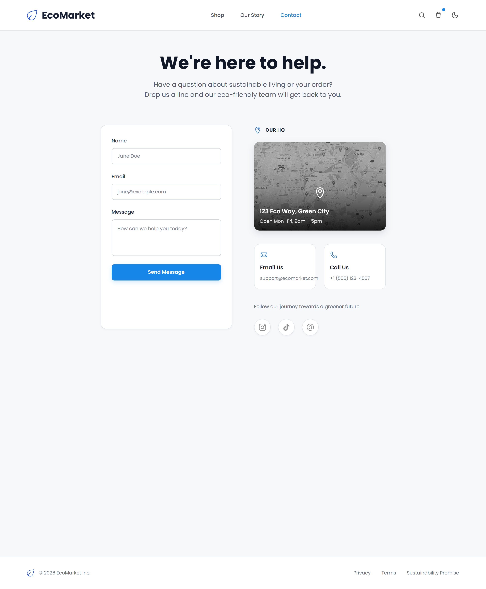
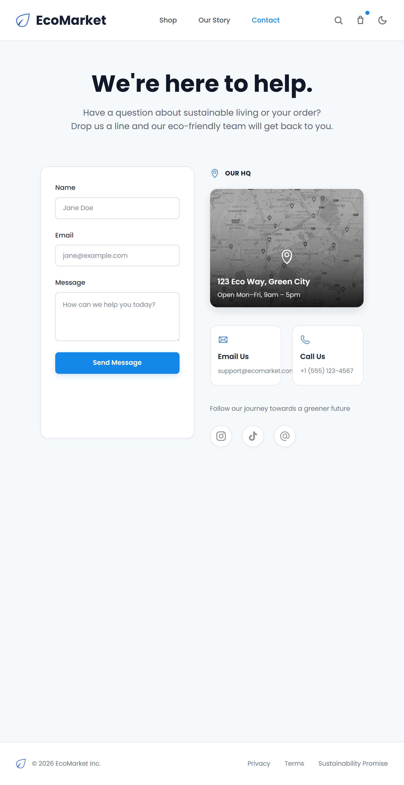

# 🌱 EcoMarket

EcoMarket es una tienda en línea dedicada a la comercialización de productos ecológicos, reutilizables y sostenibles. La plataforma busca ofrecer una experiencia visual limpia, accesible y responsiva, permitiendo a los usuarios explorar productos y conocer alternativas de consumo responsable.

El proyecto fue desarrollado utilizando únicamente **HTML5 y CSS3**, sin JavaScript ni frameworks externos. La interfaz aprovecha herramientas como CSS Grid, Flexbox, pseudoclases, animaciones y media queries para crear una experiencia interactiva y adaptable a diferentes dispositivos.

---

## 📋 Descripción del proyecto

EcoMarket nace como una propuesta digital enfocada en el consumo consciente y la sostenibilidad.

La identidad visual utiliza espacios amplios, colores naturales, imágenes relacionadas con el medio ambiente y una tipografía clara para transmitir valores de:

- Sostenibilidad.
- Transparencia.
- Responsabilidad ambiental.
- Consumo consciente.
- Accesibilidad.
- Confianza.

La plataforma cuenta con cuatro vistas principales:

1. Home.
2. Store.
3. Our Story.
4. Contact.

---

## ✨ Características principales

### 🏠 Home

La página principal presenta la identidad visual de EcoMarket y permite conocer algunos de sus productos destacados.

Incluye:

- Encabezado con logotipo y navegación.
- Banner principal con imagen de alta calidad.
- Mensaje relacionado con el consumo sostenible.
- Botones de llamada a la acción.
- Categorías de productos.
- Grid de seis productos destacados.
- Botones para agregar productos.
- Botones de favoritos.
- Efecto de elevación sobre las tarjetas.
- Sección de suscripción al boletín.
- Pie de página con enlaces y redes sociales.

---

### 🛍️ Store

La página Store presenta el catálogo completo de productos ecológicos.

Incluye:

- Barra lateral de filtros.
- Filtros visuales por categorías.
- Filtro de rango de precios.
- Filtro de disponibilidad.
- Buscador visual.
- Grid de productos desarrollado con CSS Grid.
- Nombre, descripción y precio de cada producto.
- Etiquetas de productos nuevos, ecológicos y en oferta.
- Indicadores de disponibilidad.
- Botones para agregar productos.
- Botones de favoritos.
- Paginación visual.
- Sidebar con comportamiento sticky en escritorio.

El catálogo cambia su distribución dependiendo del dispositivo:

| Dispositivo | Número de columnas |
|---|---:|
| Escritorio | 4 columnas |
| Tablet | 2 columnas |
| Celular | 1 columna |

---

### 🌿 Our Story

La página Our Story presenta la historia, misión y principios ambientales de EcoMarket.

Incluye:

- Historia de la marca.
- Secciones organizadas mediante Flexbox.
- Imágenes relacionadas con la sostenibilidad.
- Principios ecológicos.
- Iconos con descripciones.
- Información sobre comercio responsable.
- Testimonios de clientes.
- Tarjetas interactivas.
- Animaciones y efectos al pasar el cursor.

---

### ✉️ Contact

La página Contact permite a los usuarios comunicarse con EcoMarket.

Incluye:

- Formulario de contacto.
- Campo para nombre.
- Campo para correo electrónico.
- Campo para mensaje.
- Validación visual mediante CSS.
- Bordes verdes para campos válidos.
- Bordes rojos para campos inválidos.
- Imagen estática de ubicación.
- Información de correo electrónico.
- Información telefónica.
- Enlaces a redes sociales.
- Efecto de escala en los iconos sociales.

Las validaciones fueron desarrolladas únicamente con pseudoclases CSS:

```css
:valid
:invalid
:placeholder-shown
```

---

## 🛠️ Tecnologías utilizadas

- HTML5 semántico.
- CSS3.
- CSS Grid.
- Flexbox.
- Media Queries.
- Variables CSS.
- Pseudoclases CSS.
- Animaciones con `@keyframes`.
- Git.
- GitHub.
- Visual Studio Code.

El proyecto fue desarrollado sin utilizar:

- JavaScript.
- Frameworks CSS.
- Librerías externas de componentes.

---

## 📱 Diseño responsive

EcoMarket cuenta con un diseño adaptable a diferentes tamaños de pantalla.

La interfaz fue optimizada para:

- Computadores de escritorio.
- Computadores portátiles.
- Tablets.
- Dispositivos móviles.

Las tarjetas, imágenes, formularios, botones y secciones cambian su distribución mediante CSS Grid, Flexbox y media queries.

Principales puntos de adaptación:

```text
Desktop → Distribución completa en varias columnas

Tablet → Reducción y reorganización de columnas

Mobile → Contenido organizado en una sola columna
```

---

## 📁 Estructura del proyecto

```text
EcoMarket/
│
├── css/
│   ├── main.css
│   ├── layout.css
│   ├── components.css
│   └── animations.css
│
├── img/
│   ├── contact/
│   ├── hero/
│   ├── icons/
│   └── products/
│
├── views/
│   ├── productos.html
│   ├── sobre-nosotros.html
│   └── contacto.html
│
├── index.html
│
└── README.md
```

Descripción de los archivos CSS:

| Archivo | Contenido |
|---|---|
| `main.css` | Reset, variables, tipografía y estilos globales |
| `layout.css` | Header, footer, secciones y sistemas de distribución |
| `components.css` | Tarjetas, botones, formularios, filtros e inputs |
| `animations.css` | Animaciones, transiciones y keyframes |

---

## 🚀 Instrucciones de visualización

### Opción 1: Descargar el proyecto

1. Descargar o clonar el repositorio.
2. Abrir la carpeta del proyecto.
3. Abrir el archivo `index.html` en un navegador.

### Opción 2: Visual Studio Code

1. Abrir la carpeta del proyecto en Visual Studio Code.
2. Instalar la extensión Live Server.
3. Abrir el archivo `index.html`.
4. Hacer clic derecho.
5. Seleccionar **Open with Live Server**.

---

## 📸 Capturas de pantalla

### Vista de escritorio

#### Home


#### Store


#### Our Story


#### Contact



---

### Vista móvil

#### Home


#### Store


#### Our Story


#### Contact



---

## 🌐 Despliegue

La aplicación estará disponible mediante un servicio de despliegue web.

Enlace del proyecto:

> El enlace público será agregado después de realizar el despliegue.

---

## 🌳 Gestión de versiones

El proyecto utiliza Git y GitHub para el control de versiones.

Se implementó un flujo de trabajo basado en ramas de características:

```text
main
│
├── feature/home
│
├── feature/store
│
├── feature/about
│
└── feature/contact
```

Los cambios fueron registrados mediante commits descriptivos siguiendo la convención Conventional Commits.

Ejemplos:

```text
feat(home): crear estructura inicial de la página principal

feat(store): crear catálogo interactivo

feat(about): crear página Our Story completa

feat(contact): crear página Contact completa
```

---

## ♻️ Principios del proyecto

EcoMarket promueve:

- Productos reutilizables.
- Reducción de residuos.
- Consumo responsable.
- Uso de materiales sostenibles.
- Comercio consciente.
- Protección del medio ambiente.

---

## 👨‍💻 Autor

**Abdel Fabian Cristancho Rohsman**

Proyecto desarrollado como ejercicio académico de maquetación web con HTML5 y CSS3.

---

## 📄 Licencia

Este proyecto fue desarrollado con fines educativos.